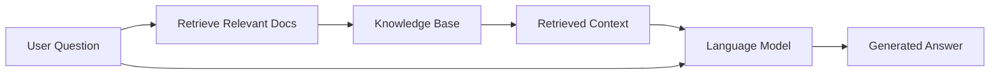

# What is RAG?

**Retrieval-Augmented Generation (RAG)** is a powerful AI technique that combines the strengths of information retrieval systems with large language models to produce more accurate, relevant, and factual responses.

## The Core Concept

At its heart, RAG works through a simple but effective two-step process:

1. **Retrieval**: Find relevant information from a knowledge base
2. **Generation**: Use that information to generate a response



## How RAG Works

Let's break down the RAG process with a concrete example:

### Example: Question Answering

**User asks**: "What are the benefits of RAG?"

**Step 1 - Retrieval**:
- Convert the question into a vector embedding
- Search the knowledge base for similar content
- Retrieve the top 3-5 most relevant passages

**Step 2 - Augmentation**:
- Combine the question with retrieved passages
- Create a prompt: "Based on the following context: [passages], answer: [question]"

**Step 3 - Generation**:
- Send the augmented prompt to the language model
- Generate a response grounded in the retrieved information

### Traditional LLMs vs. RAG

| Aspect | Traditional LLM | RAG System |
|--------|----------------|------------|
| **Knowledge Source** | Training data only | Training data + External knowledge base |
| **Information Freshness** | Limited to training cutoff | Can access recent information |
| **Accuracy** | May hallucinate | Grounded in retrieved facts |
| **Citations** | Cannot provide sources | Can cite specific documents |
| **Customization** | Requires fine-tuning | Update knowledge base easily |

## Key Components

A RAG system consists of three main components:

### 1. Knowledge Base
- Collection of documents, articles, or data
- Can be internal documentation, wikis, databases
- Stored in a format optimized for retrieval

### 2. Retrieval System
- Converts documents and queries into vector embeddings
- Uses similarity search to find relevant information
- Typically uses vector databases like Qdrant, Pinecone, or Weaviate

### 3. Generation Model
- Large language model (e.g., GPT-4, Claude, Llama)
- Takes retrieved context + user query
- Generates coherent, factual responses

## Benefits of RAG

### 🎯 Accuracy & Factuality
RAG reduces hallucinations by grounding responses in actual documents. The model can only generate based on what it retrieves.

### 📚 Dynamic Knowledge
Update your knowledge base without retraining the model. Add new documents and they're immediately available for retrieval.

### 💰 Cost-Effective
No need to fine-tune massive models. Use smaller, cheaper models with a good knowledge base.

### 🔍 Transparency
Provide source citations for every answer, allowing users to verify information and build trust.

### ⚡ Scalability
Works with knowledge bases ranging from hundreds to millions of documents.

## Common Use Cases

RAG is particularly effective for:

- **Customer Support**: Answer questions using company documentation
- **Technical Documentation**: Help users find specific information in large doc sets
- **Research Assistance**: Summarize and cite academic papers
- **Enterprise Search**: Make company knowledge accessible to employees
- **Educational Tools**: Create interactive learning experiences

## Simple Code Example

Here's what a basic RAG pipeline looks like in Python:

```python
from openai import OpenAI
from qdrant_client import QdrantClient

# Initialize clients
llm = OpenAI()
vector_db = QdrantClient()

def rag_query(question: str):
    # Step 1: Retrieve relevant documents
    query_embedding = llm.embeddings.create(
        model="text-embedding-3-small",
        input=question
    )
    
    results = vector_db.search(
        collection_name="knowledge_base",
        query_vector=query_embedding.data[0].embedding,
        limit=3
    )
    
    # Step 2: Combine context
    context = "\n\n".join([r.payload["text"] for r in results])
    
    # Step 3: Generate response
    response = llm.chat.completions.create(
        model="gpt-4o-mini",
        messages=[
            {"role": "system", "content": "Answer based on the context."},
            {"role": "user", "content": f"Context: {context}\n\nQuestion: {question}"}
        ]
    )
    
    return response.choices[0].message.content

# Usage
answer = rag_query("What are the benefits of RAG?")
print(answer)
```

:::tip Try It Yourself
The above code is a simplified example. In production, you'd add error handling, caching, and optimization. We'll cover these in Chapter 3!
:::

## Summary

RAG is a technique that enhances language models by:
- **Retrieving** relevant information from a knowledge base
- **Augmenting** the prompt with retrieved context
- **Generating** accurate, grounded responses

This approach combines the best of both worlds: the reasoning capabilities of LLMs and the factual accuracy of retrieved information.

---

**Next**: Learn [why RAG matters](why-rag-matters) and when to use it in your projects.
