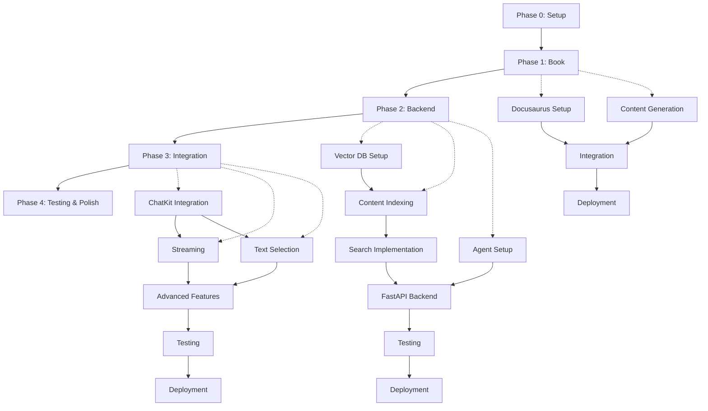

# Implementation Plan: AI-Driven Book with RAG Chatbot

**Project**: AI-Driven Book with RAG Chatbot  
**Created**: 2025-12-10  
**Status**: Ready for Execution  
**Constitution**: [constitution.md](file:///e:/hackthon/hckathon%20I/class_project/ai_book/.specify/memory/constitution.md)  
**Specifications**: [book.spec.md](file:///e:/hackthon/hckathon%20I/class_project/ai_book/book.spec.md) | [rag.spec.md](file:///e:/hackthon/hckathon%20I/class_project/ai_book/rag.spec.md) | [subagents.spec.md](file:///e:/hackthon/hckathon%20I/class_project/ai_book/subagents.spec.md) | [skills.spec.md](file:///e:/hackthon/hckathon%20I/class_project/ai_book/skills.spec.md)

---

## Executive Summary

This implementation plan orchestrates the development of an integrated system combining an AI-generated technical book with an intelligent RAG chatbot. The plan is divided into 5 phases executed sequentially with clearly defined dependencies, subagent responsibilities, and deliverables.

**Execution Order**: Phase 0 (Setup) → Phase 1 (Book) → Phase 2 (Backend) → Phase 3 (RAG Integration) → Phase 4 (Testing & Polish)

**Timeline**: 5-7 days (with all subagents working efficiently)  
**Subagents**: 4 specialized agents (BookWriter, RAGEngineer, FrontendDev, APIBuilder)  
**Skills**: 5 reusable skills loaded on-demand

---

## Technical Context

**Languages/Versions**:
- Frontend: TypeScript 5.x, React 18.x, Node.js 18.x
- Backend: Python 3.10+
- Documentation: Markdown/MDX

**Primary Dependencies**:
- Frontend: Docusaurus 3.x, OpenAI ChatKit SDK, React
- Backend: FastAPI 0.110+, OpenAI SDK 1.12+, Qdrant Client 1.7+

**Storage**:
- Vector Database: Qdrant Cloud (free tier, 1GB limit)
- Static Site: GitHub Pages
- Conversation State: In-memory/sessionStorage (no persistent DB)

**Testing**:
- Frontend: Jest, Lighthouse CI
- Backend: pytest, FastAPI TestClient
- Integration: End-to-end manual testing

**Deployment**:
- Frontend: GitHub Pages (static hosting)
- Backend: Vercel/Railway (free tier)

**Performance Goals**:
- Page load: <3 seconds (p95)
- API response: <5 seconds (p95)
- First token latency: <2 seconds (p95)
- Vector search: <500ms (p95)
- Lighthouse score: 90+

**Constraints**:
- Zero infrastructure cost (free tiers only)
- Qdrant storage: <1GB
- No authentication/user management (MVP)
- OpenAI API costs borne by user

**Scale/Scope**:
- Book: 10-15 pages, 3-4 chapters
- Vector DB: ~1,000-2,000 chunks
- Concurrent users: 10-20 (free tier limitation)

---

## Constitution Check

✅ **AI-Driven Development**: All phases leverage Claude Code subagents  
✅ **Specification-First**: Implementation follows detailed specs  
✅ **Separation of Concerns**: Clear module boundaries (book, RAG, API)  
✅ **API-First Design**: Backend designed before frontend integration  
✅ **Scalable Infrastructure**: Cloud-based, serverless architecture  
✅ **Modular Components**: Reusable subagents and skills  
✅ **Modern Tech Stack**: Latest stable versions  
✅ **Zero Cost**: Exclusively free tiers  
✅ **Quality Assurance**: Testing at each phase  
✅ **Documentation**: Self-documenting code and READMEs

**No constitution violations detected.**

---

## Project Structure

### Repository Organization

```text
ai-book-with-rag/
├── .github/
│   └── workflows/
│       └── deploy-book.yml          # GitHub Actions for book deployment
│
├── book/                             # Docusaurus project (Phase 1)
│   ├── docs/                         # Book content (markdown/MDX)
│   │   ├── intro.md
│   │   ├── chapter-1/
│   │   ├── chapter-2/
│   │   ├── chapter-3/
│   │   └── chapter-4/
│   ├── src/
│   │   ├── components/
│   │   │   └── ChatBot/             # ChatKit integration (Phase 3)
│   │   │       ├── ChatBot.tsx
│   │   │       ├── FloatingButton.tsx
│   │   │       └── TextSelector.tsx
│   │   ├── css/
│   │   │   └── custom.css
│   │   └── theme/
│   │       └── Root.tsx
│   ├── static/
│   │   ├── img/
│   │   └── favicon.ico
│   ├── docusaurus.config.ts
│   ├── sidebars.ts
│   ├── package.json
│   └── tsconfig.json
│
├── backend/                          # FastAPI application (Phase 2)
│   ├── app/
│   │   ├── main.py                   # FastAPI entry point
│   │   ├── api/
│   │   │   └── routes/
│   │   │       ├── chat.py           # Chat endpoints
│   │   │       ├── health.py
│   │   │       └── admin.py          # Re-indexing
│   │   ├── services/
│   │   │   ├── embedding.py          # OpenAI embeddings
│   │   │   ├── vector_search.py      # Qdrant search
│   │   │   ├── agent.py              # OpenAI Agents SDK
│   │   │   └── indexing.py           # Content indexing
│   │   ├── models/
│   │   │   ├── chat.py               # Pydantic models
│   │   │   └── chunk.py
│   │   ├── config/
│   │   │   ├── settings.py           # Environment config
│   │   │   └── prompts.py            # System prompts
│   │   └── utils/
│   │       ├── text_chunker.py
│   │       └── logger.py
│   ├── scripts/
│   │   ├── index_book.py             # CLI indexing tool
│   │   └── test_rag.py               # RAG testing
│   ├── tests/
│   │   ├── test_api.py
│   │   ├── test_vector_search.py
│   │   └── test_agent.py
│   ├── requirements.txt
│   ├── .env.example
│   ├── vercel.json                   # Deployment config
│   └── README.md
│
├── specs/                            # Project specifications
│   ├── book.spec.md
│   ├── rag.spec.md
│   ├── subagents.spec.md
│   └── skills.spec.md
│
├── .specify/                         # Spec-Kit Plus
│   ├── memory/
│   │   ├── constitution.md
│   │   └── task.md
│   ├── templates/
│   └── scripts/
│
├── README.md                         # Project overview
└── implementation-plan.md            # This file
```

**Structure Decision**: Web application structure (Option 2 from template) chosen because we have distinct frontend (Docusaurus) and backend (FastAPI) components that can be developed and deployed independently.

---

## Git Branching Strategy

### Branch Structure

```text
main
├── develop                          # Integration branch
│   ├── feature/phase-1-book        # Phase 1 work
│   ├── feature/phase-2-backend     # Phase 2 work
│   ├── feature/phase-3-rag         # Phase 3 work
│   └── feature/phase-4-polish      # Phase 4 work
└── hotfix/*                         # Emergency fixes
```

### Branching Workflow

1. **Main Branch** (`main`)
   - Production-ready code only
   - Protected, requires PR approval
   - Triggers deployment workflows

2. **Develop Branch** (`develop`)
   - Integration branch for all features
   - Created from `main` at project start
   - Merged to `main` after Phase 4 completion

3. **Feature Branches** (`feature/phase-X-*`)
   - Created from `develop`
   - Named after phase and component
   - Merged to `develop` at phase completion
   - Deleted after merge

### Merge Strategy

```bash
# Phase 1 completion
git checkout develop
git merge --no-ff feature/phase-1-book
git push origin develop

# Phase 2 completion
git merge --no-ff feature/phase-2-backend
git push origin develop

# ... repeat for Phases 3-4

# Final deployment
git checkout main
git merge --no-ff develop
git tag v1.0.0
git push origin main --tags
```

### Commit Convention

Follow conventional commits:
- `feat:` new feature
- `fix:` bug fix
- `docs:` documentation
- `style:` formatting
- `refactor:` code restructuring
- `test:` adding tests
- `chore:` maintenance

Example:
```
feat(book): add chapter 1 introduction to RAG
feat(backend): implement vector search endpoint
fix(chatbot): resolve streaming response issue
```

---

## Phase Breakdown

### Phase 0: Project Setup & Initialization

**Duration**: 0.5 days  
**Goal**: Set up development environment, initialize projects, create subagents  
**Status Gate**: All tools and credentials verified

#### Tasks

| Task ID | Task | Subagent | Dependencies | Deliverable |
|---------|------|----------|--------------|-------------|
| P0.1 | Create GitHub repository | Human | - | Repository created |
| P0.2 | Set up git branching structure | Human | P0.1 | `main` and `develop` branches |
| P0.3 | Create/simulate BookWriter subagent | Human/Agent | P0.1 | Subagent ready |
| P0.4 | Create/simulate RAGEngineer subagent | Human/Agent | P0.1 | Subagent ready |
| P0.5 | Create/simulate FrontendDev subagent | Human/Agent | P0.1 | Subagent ready |
| P0.6 | Create/simulate APIBuilder subagent | Human/Agent | P0.1 | Subagent ready |
| P0.7 | Prepare skill modules | Agent | P0.3-P0.6 | Skills documented |
| P0.8 | Set up OpenAI API key | Human | - | Key configured |
| P0.9 | Set up Qdrant Cloud account | Human | - | Cluster created, API key obtained |
| P0.10 | Initialize feature branch | Agent | P0.2 | `feature/phase-1-book` created |

#### Deliverables

- [x] GitHub repository with branching structure
- [x] 4 subagents created/simulated
- [x] 5 skills prepared and documented
- [x] OpenAI API key secured
- [x] Qdrant Cloud cluster ready
- [x] Feature branch ready for Phase 1

#### Success Criteria

- Repository accessible and cloned locally
- All subagents can be activated
- API keys validated (test calls successful)
- Feature branch created from `develop`

---

### Phase 1: AI-Driven Book Development

**Duration**: 1.5-2 days  
**Goal**: Generate book content, set up Docusaurus, deploy to GitHub Pages  
**Lead Subagent**: FrontendDev (project setup), BookWriter (content)  
**Status Gate**: Book deployed and accessible online

#### Task Sequence

##### Phase 1.1: Docusaurus Setup

| Task ID | Task | Subagent | Skill Used | Dependencies | Deliverable |
|---------|------|----------|------------|--------------|-------------|
| P1.1 | Load Docusaurus Setup skill | FrontendDev | docusaurus-setup | P0.10 | Skill loaded |
| P1.2 | Initialize Docusaurus project | FrontendDev | docusaurus-setup | P1.1 | `book/` directory created |
| P1.3 | Configure TypeScript | FrontendDev | docusaurus-setup | P1.2 | tsconfig.json |
| P1.4 | Set up custom theme | FrontendDev | - | P1.2 | custom.css, branding |
| P1.5 | Configure sidebar navigation | FrontendDev | - | P1.2 | sidebars.ts |
| P1.6 | Enable search (local) | FrontendDev | - | P1.2 | Search configured |
| P1.7 | Configure dark mode | FrontendDev | - | P1.2 | Color mode settings |
| P1.8 | Test local build | FrontendDev | - | P1.2-P1.7 | `npm run build` succeeds |

##### Phase 1.2: Content Generation

| Task ID | Task | Subagent | Skill Used | Dependencies | Deliverable |
|---------|------|----------|------------|--------------|-------------|
| P1.9 | Create content outline | BookWriter | - | - | Outline document |
| P1.10 | Review/approve outline | Human | - | P1.9 | Approved outline |
| P1.11 | Generate Chapter 1: Introduction | BookWriter | - | P1.10 | 2-3 pages |
| P1.12 | Generate Chapter 2: Core Concepts | BookWriter | - | P1.10 | 3-4 pages |
| P1.13 | Generate Chapter 3: Advanced Topics | BookWriter | - | P1.10 | 2-3 pages |
| P1.14 | Generate Chapter 4: Resources | BookWriter | - | P1.10 | 1-2 pages |
| P1.15 | Create code examples (10+) | BookWriter | - | P1.11-P1.14 | Tested code blocks |
| P1.16 | Generate diagrams (2+) | BookWriter | - | P1.11-P1.14 | Mermaid/images |
| P1.17 | Create cross-references | BookWriter | - | P1.11-P1.14 | Internal links |
| P1.18 | Create metadata files | BookWriter | - | P1.11-P1.14 | _category_.json files |

##### Phase 1.3: Content Integration

| Task ID | Task | Subagent | Dependencies | Deliverable |
|---------|------|----------|-------------|-------------|
| P1.19 | Copy content to `book/docs/` | FrontendDev | P1.11-P1.18 | Content in place |
| P1.20 | Validate all links | FrontendDev | P1.19 | No broken links |
| P1.21 | Optimize images | FrontendDev | P1.19 | WebP/compressed |
| P1.22 | Test responsive design | FrontendDev | P1.19 | Mobile/tablet verified |
| P1.23 | Add SEO metadata | FrontendDev | P1.19 | Meta tags complete |
| P1.24 | Run Lighthouse audit | FrontendDev | P1.19-P1.23 | Score 90+ |

##### Phase 1.4: Deployment

| Task ID | Task | Subagent | Skill Used | Dependencies | Deliverable |
|---------|------|----------|------------|--------------|-------------|
| P1.25 | Load GitHub Pages Deploy skill | FrontendDev | github-pages-deploy | - | Skill loaded |
| P1.26 | Create deployment workflow | FrontendDev | github-pages-deploy | P1.25 | .github/workflows/deploy-book.yml |
| P1.27 | Configure repository settings | Human | - | P1.26 | Pages enabled |
| P1.28 | Push to trigger deployment | FrontendDev | - | P1.26-P1.27 | Site deploying |
| P1.29 | Verify deployment | FrontendDev | - | P1.28 | Site accessible |
| P1.30 | Test all functionality online | FrontendDev + Human | - | P1.29 | All features work |

#### Deliverables

- [x] Docusaurus project initialized and configured
- [x] 10+ pages of book content generated
- [x] Content organized into 3-4 chapters
- [x] Custom branding and styling applied
- [x] Search functionality enabled
- [x] Dark mode working
- [x] GitHub Actions deployment workflow
- [x] Book deployed to GitHub Pages
- [x] Lighthouse score 90+
- [x] All links and images verified

#### Handoff Document

**From**: FrontendDev + BookWriter  
**To**: RAGEngineer (for Phase 2)  
**Deliverable**: Deployed book with accessible content

**What's Included**:
- Live book URL: `https://[username].github.io/[repo-name]`
- All pages accessible and indexed
- Semantic HTML structure for scraping
- sitemap.xml generated

**How to Use**:
- Use book URL for content extraction
- All content is in `<article>` tags with proper headings
- Each page has `<meta>` tags with title and description

**Known Issues**: None expected

---

### Phase 2: Backend Infrastructure & Vector Database

**Duration**: 2-3 days  
**Goal**: Build FastAPI backend, set up Qdrant, implement RAG pipeline  
**Lead Subagent**: RAGEngineer (vector DB), APIBuilder (API)  
**Status Gate**: Backend deployed with working search endpoint

#### Task Sequence

##### Phase 2.1: Vector Database Setup

| Task ID | Task | Subagent | Skill Used | Dependencies | Deliverable |
|---------|------|----------|------------|--------------|-------------|
| P2.1 | Load Qdrant Integration skill | RAGEngineer | qdrant-integration | P1.30 | Skill loaded |
| P2.2 | Create Qdrant collection | RAGEngineer | qdrant-integration | P2.1, P0.9 | Collection created |
| P2.3 | Configure vector parameters | RAGEngineer | qdrant-integration | P2.2 | 1536 dims, Cosine |
| P2.4 | Test connection | RAGEngineer | qdrant-integration | P2.3 | Connection verified |

##### Phase 2.2: Content Indexing

| Task ID | Task | Subagent | Dependencies | Deliverable |
|---------|------|----------|-------------|-------------|
| P2.5 | Create web scraper for book | RAGEngineer | P1.30 | scraper.py |
| P2.6 | Extract all page content | RAGEngineer | P2.5 | Raw text extracted |
| P2.7 | Implement text chunking | RAGEngineer | P2.6 | chunker.py (500-1000 tokens) |
| P2.8 | Test chunking strategy | RAGEngineer | P2.7 | Optimal chunk size found |
| P2.9 | Generate embeddings (OpenAI) | RAGEngineer | P2.8, P0.8 | Embeddings for all chunks |
| P2.10 | Store in Qdrant with metadata | RAGEngineer | P2.9, P2.4 | All chunks indexed |
| P2.11 | Verify storage usage | RAGEngineer | P2.10 | <1GB confirmed |
| P2.12 | Create re-indexing script | RAGEngineer | P2.10 | scripts/index_book.py |

##### Phase 2.3: Search Implementation

| Task ID | Task | Subagent | Dependencies | Deliverable |
|---------|------|----------|-------------|-------------|
| P2.13 | Implement vector search function | RAGEngineer | P2.10 | vector_search.py |
| P2.14 | Add metadata filtering | RAGEngineer | P2.13 | Filter by page/section |
| P2.15 | Test search with sample questions | RAGEngineer | P2.14 | Relevant results returned |
| P2.16 | Optimize search parameters | RAGEngineer | P2.15 | <500ms latency |
| P2.17 | Create search API wrapper | RAGEngineer | P2.16 | QdrantManager class |

##### Phase 2.4: OpenAI Agent Setup

| Task ID | Task | Subagent | Skill Used | Dependencies | Deliverable |
|---------|------|----------|------------|--------------|-------------|
| P2.18 | Load OpenAI Agent Builder skill | APIBuilder | openai-agent-builder | - | Skill loaded |
| P2.19 | Create RAGAgent class | APIBuilder | openai-agent-builder | P2.18, P0.8 | agent.py |
| P2.20 | Configure system prompt | APIBuilder | openai-agent-builder | P2.19 | RAG-optimized prompt |
| P2.21 | Implement streaming support | APIBuilder | - | P2.19 | Streaming working |
| P2.22 | Test agent with sample context | APIBuilder | - | P2.21 | Accurate answers |

##### Phase 2.5: FastAPI Backend

| Task ID | Task | Subagent | Dependencies | Deliverable |
|---------|------|----------|-------------|-------------|
| P2.23 | Initialize FastAPI project | APIBuilder | - | backend/ structure |
| P2.24 | Create Pydantic models | APIBuilder | - | models/chat.py |
| P2.25 | Implement POST /api/chat | APIBuilder | P2.22, P2.17 | Non-streaming endpoint |
| P2.26 | Implement POST /api/chat/stream | APIBuilder | P2.25 | Streaming endpoint (SSE) |
| P2.27 | Implement GET /api/health | APIBuilder | - | Health check |
| P2.28 | Implement POST /api/reindex | APIBuilder | P2.12 | Admin endpoint |
| P2.29 | Add CORS middleware | APIBuilder | - | Frontend domains allowed |
| P2.30 | Implement error handling | APIBuilder | P2.25-P2.28 | Graceful errors |
| P2.31 | Add request logging | APIBuilder | P2.25-P2.28 | Structured logs |
| P2.32 | Create .env.example | APIBuilder | - | Template for config |

##### Phase 2.6: Testing

| Task ID | Task | Subagent | Dependencies | Deliverable |
|---------|------|----------|-------------|-------------|
| P2.33 | Write unit tests (search) | RAGEngineer | P2.17 | test_vector_search.py |
| P2.34 | Write unit tests (agent) | APIBuilder | P2.22 | test_agent.py |
| P2.35 | Write API integration tests | APIBuilder | P2.25-P2.28 | test_api.py |
| P2.36 | Run all tests | APIBuilder | P2.33-P2.35 | All tests pass |

##### Phase 2.7: Deployment

| Task ID | Task | Subagent | Dependencies | Deliverable |
|---------|------|----------|-------------|-------------|
| P2.37 | Create Vercel config | APIBuilder | P2.36 | vercel.json |
| P2.38 | Set environment variables | Human | - | Secrets in Vercel |
| P2.39 | Deploy to Vercel | APIBuilder | P2.37-P2.38 | Backend live |
| P2.40 | Test deployed endpoints | APIBuilder | P2.39 | All endpoints work |
| P2.41 | Document API | APIBuilder | P2.40 | README with examples |

#### Deliverables

- [x] Qdrant collection created and populated
- [x] ~1,000-2,000 chunks indexed with embeddings
- [x] Vector search returning relevant results (<500ms)
- [x] OpenAI Agent configured for RAG
- [x] FastAPI backend with 4 endpoints
- [x] CORS configured for GitHub Pages domain
- [x] Unit and integration tests passing
- [x] Backend deployed to Vercel
- [x] API documentation complete

#### Handoff Document

**From**: RAGEngineer + APIBuilder  
**To**: FrontendDev (for Phase 3)  
**Deliverable**: Working backend API with RAG capabilities

**What's Included**:
- Backend URL: `https://[app-name].vercel.app`
- Endpoints:
  - `POST /api/chat` (non-streaming)
  - `POST /api/chat/stream` (SSE)
  - `GET /api/health`
  - `POST /api/reindex` (admin)
- Search functionality returning top-5 relevant chunks
- OpenAI Agent generating answers with citations

**How to Use**:
```javascript
// Non-streaming
const response = await fetch('https://api-url/api/chat', {
  method: 'POST',
  headers: { 'Content-Type': 'application/json' },
  body: JSON.stringify({
    question: "What is RAG?",
    conversation_id: "uuid"
  })
});

// Streaming
const eventSource = new EventSource('https://api-url/api/chat/stream?question=...');
eventSource.onmessage = (event) => {
  const data = JSON.parse(event.data);
  // Handle token
};
```

**Known Issues**: None expected

---

### Phase 3: RAG Integration & ChatKit UI

**Duration**: 1.5-2 days  
**Goal**: Integrate chatbot into book pages with text selection  
**Lead Subagent**: FrontendDev  
**Status Gate**: Chatbot functional on deployed book site

#### Task Sequence

##### Phase 3.1: ChatKit Integration

| Task ID | Task | Subagent | Dependencies | Deliverable |
|---------|------|----------|-------------|-------------|
| P3.1 | Install ChatKit SDK | FrontendDev | P2.41 | Package installed |
| P3.2 | Create ChatBot component | FrontendDev | P3.1 | src/components/ChatBot/ChatBot.tsx |
| P3.3 | Create FloatingButton component | FrontendDev | P3.1 | FloatingButton.tsx |
| P3.4 | Configure ChatKit with backend URL | FrontendDev | P3.2, P2.41 | Backend connected |
| P3.5 | Implement open/close logic | FrontendDev | P3.3 | Modal functionality |
| P3.6 | Style chat UI to match book | FrontendDev | P3.5 | Consistent design |
| P3.7 | Test basic chat flow | FrontendDev | P3.6 | Questions → Answers work |

##### Phase 3.2: Streaming Responses

| Task ID | Task | Subagent | Dependencies | Deliverable |
|---------|------|----------|-------------|-------------|
| P3.8 | Implement SSE client | FrontendDev | P3.7 | EventSource handling |
| P3.9 | Display streaming tokens | FrontendDev | P3.8 | Real-time display |
| P3.10 | Add stop generation button | FrontendDev | P3.9 | Stream cancellation |
| P3.11 | Test streaming performance | FrontendDev | P3.10 | Smooth updates |

##### Phase 3.3: Text Selection Handler

| Task ID | Task | Subagent | Skill Used | Dependencies | Deliverable |
|---------|------|----------|------------|--------------|-------------|
| P3.12 | Load Text Selection Handler skill | FrontendDev | text-selection-handler | - | Skill loaded |
| P3.13 | Create useTextSelection hook | FrontendDev | text-selection-handler | P3.12 | TextSelector.tsx |
| P3.14 | Implement selection detection | FrontendDev | text-selection-handler | P3.13 | mouseup/selectionchange events |
| P3.15 | Create "Ask about this" button | FrontendDev | - | P3.14 | Contextual UI element |
| P3.16 | Connect selection to chat | FrontendDev | - | P3.15, P3.2 | Pre-populate chat |
| P3.17 | Test with various selections | FrontendDev | - | P3.16 | Text/code/multi-para |

##### Phase 3.4: Advanced Features

| Task ID | Task | Subagent | Dependencies | Deliverable |
|---------|------|----------|-------------|-------------|
| P3.18 | Implement conversation history | FrontendDev | P3.7 | sessionStorage persistence |
| P3.19 | Add "New conversation" button | FrontendDev | P3.18 | Clear history |
| P3.20 | Render Markdown in responses | FrontendDev | P3.7 | Code blocks, formatting |
| P3.21 | Make citations clickable | FrontendDev | P3.20 | Navigate to source |
| P3.22 | Add loading indicators | FrontendDev | P3.7 | Spinner/skeleton |
| P3.23 | Display error messages in UI | FrontendDev | P3.7 | User-friendly errors |

##### Phase 3.5: Testing & Optimization

| Task ID | Task | Subagent | Dependencies | Deliverable |
|---------|------|----------|-------------|-------------|
| P3.24 | Test on desktop browsers | FrontendDev | P3.23 | Chrome/Firefox/Safari/Edge |
| P3.25 | Test on mobile devices | FrontendDev | P3.23 | Touch interactions |
| P3.26 | Test responsive chat UI | FrontendDev | P3.23 | 3+ screen sizes |
| P3.27 | Optimize bundle size | FrontendDev | P3.26 | Code splitting |
| P3.28 | Run Lighthouse audit | FrontendDev | P3.27 | Score still 90+ |

##### Phase 3.6: Deployment

| Task ID | Task | Subagent | Dependencies | Deliverable |
|---------|------|----------|-------------|-------------|
| P3.29 | Build production bundle | FrontendDev | P3.28 | npm run build |
| P3.30 | Deploy to GitHub Pages | FrontendDev | P3.29 | Push to trigger workflow |
| P3.31 | Verify chatbot on live site | FrontendDev + Human | P3.30 | End-to-end test |

#### Deliverables

- [x] ChatKit SDK integrated
- [x] Floating chat button on all pages
- [x] Chat modal with streaming responses
- [x] Text selection handler working
- [x] "Ask about selection" functionality
- [x] Conversation history persisting
- [x] Markdown rendering in answers
- [x] Clickable source citations
- [x] Error handling in UI
- [x] Mobile-responsive design
- [x] Deployed with chatbot functional

#### Success Criteria

- User can click chat button and ask questions
- Answers stream in real-time
- User can select text and ask about it
- Citations link to correct pages
- Works on mobile and desktop
- No degradation in Lighthouse score

---

### Phase 4: Testing, Polish & Documentation

**Duration**: 1 day  
**Goal**: Comprehensive testing, bug fixes, final polish, documentation  
**Lead**: All Subagents + Human  
**Status Gate**: Project ready for presentation/handoff

#### Task Sequence

##### Phase 4.1: Comprehensive Testing

| Task ID | Task | Subagent | Dependencies | Deliverable |
|---------|------|----------|-------------|-------------|
| P4.1 | Create test question set | Human | P3.31 | 20+ test questions |
| P4.2 | Test all questions | Human + FrontendDev | P4.1 | Results documented |
| P4.3 | Validate answer accuracy | Human | P4.2 | 90%+ correct |
| P4.4 | Test error scenarios | FrontendDev | P3.31 | Error handling validated |
| P4.5 | Test rate limiting | APIBuilder | P3.31 | Graceful degradation |
| P4.6 | Load test backend | APIBuilder | P3.31 | 10 concurrent users |
| P4.7 | Test re-indexing script | RAGEngineer | P2.12 | Works correctly |

##### Phase 4.2: Bug Fixes & Polish

| Task ID | Task | Subagent | Dependencies | Deliverable |
|---------|------|----------|-------------|-------------|
| P4.8 | Fix any bugs from testing | Relevant Subagent | P4.1-P4.7 | All bugs resolved |
| P4.9 | Improve UI/UX based on testing | FrontendDev | P4.8 | Refinements applied |
| P4.10 | Optimize slow queries | RAGEngineer + APIBuilder | P4.8 | Performance improved |

##### Phase 4.3: Documentation

| Task ID | Task | Subagent | Dependencies | Deliverable |
|---------|------|----------|-------------|-------------|
| P4.11 | Write project README | All | P4.10 | Root README.md |
| P4.12 | Write book deployment guide | FrontendDev | P4.10 | book/README.md |
| P4.13 | Write backend deployment guide | APIBuilder | P4.10 | backend/README.md |
| P4.14 | Document re-indexing process | RAGEngineer | P4.10 | Indexing guide |
| P4.15 | Create user guide for chatbot | FrontendDev | P4.10 | How to use chatbot |
| P4.16 | Document subagents & skills | All | P4.10 | Lessons learned |

##### Phase 4.4: Final Verification

| Task ID | Task | Subagent | Dependencies | Deliverable |
|---------|------|----------|-------------|-------------|
| P4.17 | Final Lighthouse audit | FrontendDev | P4.9 | Score 90+ |
| P4.18 | Verify all links work | FrontendDev | P4.9 | No broken links |
| P4.19 | Check SEO meta tags | FrontendDev | P4.9 | Complete metadata |
| P4.20 | Verify storage limits | RAGEngineer | P4.9 | <1GB Qdrant usage |
| P4.21 | Test with fresh browser | Human | P4.9 | First-time UX good |

##### Phase 4.5: Presentation Prep

| Task ID | Task | Subagent | Dependencies | Deliverable |
|---------|------|----------|-------------|-------------|
| P4.22 | Create demo video/walkthrough | Human | P4.21 | Demo ready |
| P4.23 | Prepare presentation slides | Human | P4.21 | Slides created |
| P4.24 | Document achievements | All | P4.21 | Success metrics |

##### Phase 4.6: Final Merge

| Task ID | Task | Subagent | Dependencies | Deliverable |
|---------|------|----------|-------------|-------------|
| P4.25 | Merge develop to main | Human | P4.24 | Production deployment |
| P4.26 | Tag release v1.0.0 | Human | P4.25 | Release tagged |

#### Deliverables

- [x] All tests passing
- [x] All bugs fixed
- [x] Complete documentation
- [x] User guides created
- [x] Demo video prepared
- [x] Code merged to main
- [x] v1.0.0 release tagged

#### Success Criteria

- 90%+ test questions answered correctly
- All error scenarios handled gracefully
- Lighthouse score 90+
- Documentation complete and tested
- Project ready for handoff/presentation

---

## Subagent Responsibility Matrix

| Phase | BookWriter | RAGEngineer | FrontendDev | APIBuilder | Human |
|-------|------------|-------------|-------------|------------|-------|
| **Phase 0: Setup** | - | - | - | - | ● Lead |
| **Phase 1: Book** | ● Lead (content) | - | ● Lead (setup) | - | ○ Review |
| **Phase 2: Backend** | - | ● Lead (vector DB) | - | ● Lead (API) | ○ Deploy |
| **Phase 3: Integration** | - | - | ● Lead | - | ○ Test |
| **Phase 4: Polish** | ○ Support | ○ Support | ● Support | ○ Support | ● Lead |

**Legend**: ● Lead, ○ Support, - Not involved

---

## Dependency Graph



---

## Critical Path

**Critical path** (minimum sequence for working MVP):

1. **P0**: Repository + Credentials → **0.5 days**
2. **P1.1-P1.2**: Docusaurus + Content → **1 day**
3. **P1.3-P1.4**: Integration + Deployment → **0.5 days**
4. **P2.1-P2.3**: Vector DB + Indexing + Search → **1 day**
5. **P2.4-P2.7**: Agent + API + Deploy → **1.5 days**
6. **P3.1-P3.2**: ChatKit + Streaming → **1 day**
7. **P3.6**: Deploy integrated system → **0.5 days**
8. **P4**: Testing + Polish → **1 day**

**Total Critical Path**: **7 days**

---

## Risk Management

### High-Risk Items

| Risk | Phase | Mitigation | Owner |
|------|-------|------------|-------|
| Qdrant free tier exceeded | P2.2 | Monitor usage, optimize chunk size | RAGEngineer |
| OpenAI API costs too high | P2.5, P3 | Use gpt-4o-mini, implement caching | APIBuilder |
| Vector search not relevant | P2.3 | Test multiple chunking strategies | RAGEngineer |
| Streaming fails on some browsers | P3.2 | Implement fallback to non-streaming | FrontendDev |
| CORS issues | P3.1 | Test early with deployed URLs | APIBuilder |
| Deployment failures | P1.4, P2.7, P3.6 | Test workflows on feature branches first | FrontendDev |

### Contingency Plans

- **If Qdrant limit exceeded**: Reduce chunk count (increase chunk size to 1500 tokens)
- **If search quality poor**: Implement hybrid search (vector + keyword)
- **If API costs too high**: Batch requests, add aggressive caching
- **If ChatKit SDK issues**: Build custom chat UI as fallback

---

## Next Steps

### Immediate Next Steps (Today)

1. **Human**: Review and approve this implementation plan
2. **Human**: Answer open questions from specifications
3. **Human**: Set up GitHub repository
4. **Human**: Obtain OpenAI API key and Qdrant Cloud account

### After Approval

1. **Run `/sp.tasks`**: Generate granular task breakdown for Phase 0 and Phase 1
2. **Execute Phase 0**: Set up infrastructure and subagents
3. **Begin Phase 1**: Start with Docusaurus setup and content generation

---

## Success Metrics

### Phase Completion Metrics

| Phase | Success Indicator | Measurement |
|-------|------------------|-------------|
| Phase 0 | Setup complete | All subagents ready, credentials validated |
| Phase 1 | Book deployed | Lighthouse 90+, accessible online |
| Phase 2 | Backend working | API endpoints return correct responses |
| Phase 3 | Chatbot integrated | User can ask questions and get answers |
| Phase 4 | Project complete | All tests pass, documentation ready |

### Overall Project Success

- ✅ Book with 10+ pages deployed to GitHub Pages
- ✅ RAG chatbot answering questions accurately (90%+)
- ✅ Text selection feature working
- ✅ Streaming responses functional
- ✅ All within free tier limits
- ✅ Complete documentation
- ✅ 4 subagents demonstrated
- ✅ 5 reusable skills created

---

**Implementation Plan Status**: ✅ Ready for Execution  
**Estimated Duration**: 5-7 days  
**Next Command**: `/sp.tasks` to generate detailed task breakdown  
**Approval Required**: Yes - awaiting human confirmation to proceed
