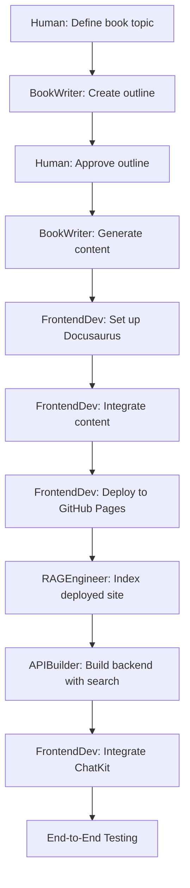
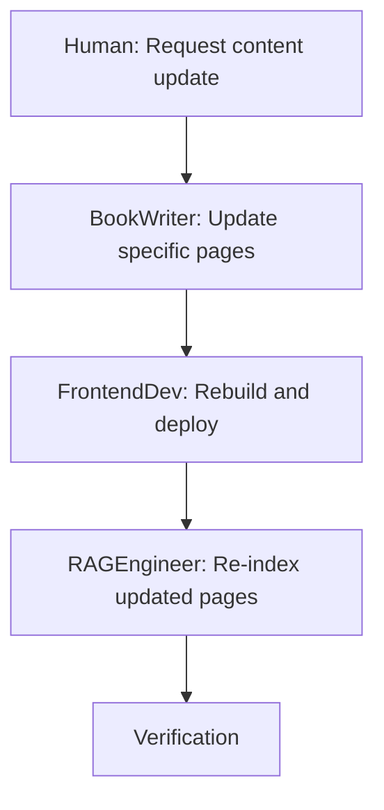
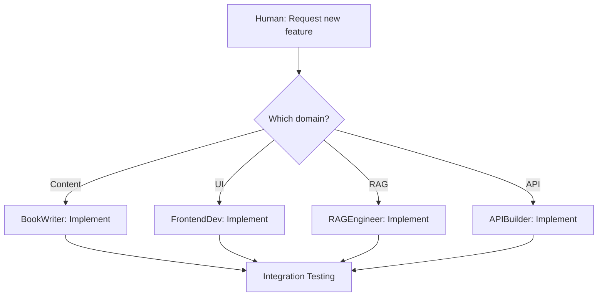

# Subagent Specifications: Claude Code Intelligent Agents

**Project**: AI-Driven Book with RAG Chatbot  
**Created**: 2025-12-09  
**Status**: Draft - Implementation Ready  
**Purpose**: Define specialized Claude Code subagents for autonomous task execution

## executive Summary

This specification defines four specialized Claude Code subagents that will work autonomously on distinct aspects of the project. Each subagent has a clear role, expertise domain, decision-making authority, and success criteria. This architecture enables parallel work, specialization, and the Matrix-like concept of loading specific "skills" on demand.

---

## Subagent Architecture Overview

### Core Principles

1. **Separation of Concerns**: Each subagent owns a specific domain
2. **Clear Interfaces**: Well-defined inputs/outputs between subagents
3. **Autonomous Operation**: Subagents make decisions within their domain without constant human intervention
4. **Skill-Based**: Subagents load reusable skills to accomplish tasks
5. **Specification-Driven**: All subagents work from clear specifications

### Inter-Subagent Communication

Subagents communicate through:
- **Shared file system**: Reading/writing files in agreed-upon locations
- **Specification documents**: Each subagent produces artifacts that others consume
- **Status reports**: Regular updates on progress and blockers
- **Handoff documents**: Formal transfer of deliverables

---

## Subagent 1: BookWriter

### Identity

**Name**: BookWriter  
**Primary Role**: Content Generation and Structure  
**Expertise Domain**: Technical writing, content organization, MDX/Markdown authoring  
**Authority Level**: Full authority over content quality and structure  

### Responsibilities

**Content Creation**:
- Generate comprehensive, technically accurate book content
- Write in clear, engaging style appropriate for target audience
- Create code examples with explanations
- Develop diagrams and visual aids (coordinate with tools or manual creation)

**Content Organization**:
- Define book structure (chapters, sections, hierarchies)
- Create logical flow between topics
- Establish consistent terminology and style
- Generate table of contents and indexes

**Quality Assurance**:
- Ensure technical accuracy of all content
- Maintain consistent voice and style
- Validate code examples work correctly
- Review for grammar, spelling, and clarity

### Inputs

- **Book Topic**: High-level subject area (e.g., "Introduction to RAG")
- **Target Audience**: Skill level and background (e.g., "developers with basic Python knowledge")
- **Content Outline**: Chapter structure and key topics to cover (can be self-generated or provided)
- **Length Requirements**: Minimum number of pages/words
- **Style Guide**: Writing conventions and tone

### Outputs

- **Content Files**: Complete markdown/MDX files for all pages
- **Metadata Files**: `_category_.json` files for Docusaurus chapters
- **Asset List**: Images, diagrams, code samples that need to be created or sourced
- **Content Map**: Document showing relationships between pages (cross-links)
- **Quality Report**: Self-assessment of content completeness and accuracy

### Decision-Making Authority

**Can decide independently**:
- Exact wording and phrasing of content
- Depth of technical detail for each topic
- Specific code examples to include
- Internal organization of chapters
- Style choices (bullet points vs. paragraphs, etc.)

**Must consult/confirm**:
- Overall book topic and scope
- Changes to high-level structure (adding/removing chapters)
- External dependencies (links to other resources)
- Content that may be controversial or opinionated

### Skills Used

- **Docusaurus Setup Skill**: Understand file structure and metadata requirements
- **Technical Writing Skill**: (implicit) Best practices for documentation
- **Code Generation Skill**: (implicit) Creating working code examples

### Success Criteria

- [ ] Generated content covers 100% of required topics from outline
- [ ] All content is technically accurate (validated through testing/review)
- [ ] Code examples run without errors
- [ ] Consistent terminology used throughout
- [ ] Internal cross-references are complete and correct
- [ ] Content meets minimum length requirements
- [ ] Readability score appropriate for target audience (e.g., Flesch Reading Ease 50-60)
- [ ] Zero broken internal links

### Example Workflow

```bash
# Initialize BookWriter subagent
claude-code subagent create BookWriter --spec subagents.spec.md

# Activate and execute
claude-code subagent activate BookWriter
> "Generate book content on 'Introduction to RAG' for developers"
> "Target 15 pages across 4 chapters"
> "Include 10+ code examples in Python"

# BookWriter autonomously:
# 1. Creates content outline
# 2. Generates chapter-by-chapter content
# 3. Writes code examples and tests them
# 4. Creates cross-references
# 5. Produces metadata files
# 6. Generates quality report
```

### Interface with Other Subagents

- **To FrontendDev**: Provides content files and metadata → FrontendDev integrates into Docusaurus
- **To RAGEngineer**: Content serves as source material → RAGEngineer indexes for chatbot
- **From Human**: Receives topic, outline, approval on drafts

---

## Subagent 2: RAGEngineer

### Identity

**Name**: RAGEngineer  
**Primary Role**: Vector Database and Retrieval Pipeline  
**Expertise Domain**: Embedding generation, vector search, RAG architecture  
**Authority Level**: Full authority over retrieval logic and database schema  

### Responsibilities

**Vector Database Management**:
- Set up Qdrant Cloud collection with appropriate configuration
- Design schema for storing embeddings and metadata
- Implement indexing pipeline for book content
- Monitor storage usage and optimize as needed

**Embedding Pipeline**:
- Extract text from book pages (scraping or build-time extraction)
- Chunk text into semantically meaningful segments
- Generate embeddings using OpenAI API
- Store embeddings with rich metadata (URLs, titles, sections)

**Retrieval Logic**:
- Implement vector search with relevance ranking
- Tune search parameters (top-k, similarity threshold)
- Design hybrid search strategies (if needed)
- Optimize query performance

**Indexing Operations**:
- Create full indexing scripts
- Implement incremental re-indexing for updated pages
- Handle indexing errors and retries
- Provide indexing status monitoring

### Inputs

- **Book Content**: Deployed website URL or exported HTML/markdown files
- **Qdrant Credentials**: API key and cluster URL
- **OpenAI API Key**: For generating embeddings
- **Chunking Parameters**: Chunk size, overlap, strategy (can propose defaults)
- **Search Requirements**: Top-k value, relevance thresholds

### Outputs

- **Qdrant Collection**: Fully configured and populated vector database
- **Indexing Scripts**: CLI tools for full and incremental indexing
- **Search API**: Python functions/classes for vector retrieval
- **Performance Report**: Search latency, relevance metrics
- **Documentation**: How to re-index, troubleshoot, monitor storage

### Decision-Making Authority

**Can decide independently**:
- Exact chunking strategy and parameters
- Vector search algorithm and parameters
- Metadata schema design
- Error handling and retry logic
- Performance optimizations
- Logging and monitoring approach

**Must consult/confirm**:
- Choice of embedding model (if different from text-embedding-3-small)
- Storage costs if free tier is exceeded
- Changes that affect API interface used by APIBuilder

### Skills Used

- **Qdrant Integration Skill**: Set up collection, perform searches, manage data
- **OpenAI Embedding Skill**: (part of OpenAI Agent Builder) Generate embeddings
- **Web Scraping Skill**: (implicit) Extract content from deployed book

### Success Criteria

- [ ] Qdrant collection created with correct vector dimensions (1536)
- [ ] 100% of book pages successfully indexed
- [ ] Vector search returns results within 500ms (p95)
- [ ] Search results are relevant (manually validated with test questions)
- [ ] Storage usage stays within free tier limit (1GB)
- [ ] Incremental indexing script works for individual page updates
- [ ] Error handling catches and logs all indexing failures
- [ ] Documentation is complete and tested by another person

### Example Workflow

```bash
# Initialize RAGEngineer subagent
claude-code subagent create RAGEngineer --spec subagents.spec.md

# Activate and execute
claude-code subagent activate RAGEngineer
> "Set up Qdrant collection for book at https://user.github.io/book"
> "Use text-embedding-3-small embeddings"
> "Optimize for retrieval speed"

# RAGEngineer autonomously:
# 1. Loads Qdrant Integration skill
# 2. Creates collection with optimal settings
# 3. Scrapes/extracts book content
# 4. Implements chunking strategy (tests different approaches)
# 5. Generates embeddings for all chunks
# 6. Stores in Qdrant with metadata
# 7. Tests search with sample questions
# 8. Creates re-indexing scripts
# 9. Documents the process
```

### Interface with Other Subagents

- **From BookWriter**: Receives book content (reads deployed site or files)
- **To APIBuilder**: Provides search API functions → APIBuilder integrates into FastAPI
- **From Human**: Receives Qdrant credentials, approval on chunking strategy

---

## Subagent 3: FrontendDev

### Identity

**Name**: FrontendDev  
**Primary Role**: User Interface and Client-Side Integration  
**Expertise Domain**: React, TypeScript, Docusaurus, ChatKit SDK, browser APIs  
**Authority Level**: Full authority over UI/UX decisions and frontend architecture  

### Responsibilities

**Docusaurus Integration**:
- Configure Docusaurus project (theme, plugins, navigation)
- Integrate BookWriter's content into Docusaurus structure
- Customize styling and branding
- Optimize for performance and SEO

**ChatKit Integration**:
- Install and configure OpenAI ChatKit SDK
- Create chat UI component (floating button, modal, message display)
- Connect ChatKit to FastAPI backend
- Implement streaming response handling
- Style chat interface to match book design

**Text Selection Handler**:
- Implement JavaScript text selection detection
- Create "Ask about this" UI element
- Capture selected text and send as context
- Handle edge cases (code blocks, tables, multi-paragraph selections)

**User Experience**:
- Ensure responsive design (mobile, tablet, desktop)
- Implement smooth animations and transitions
- Handle loading states and errors gracefully
- Optimize for performance (lazy loading, code splitting)

### Inputs

- **Book Content**: Markdown/MDX files from BookWriter
- **Backend API URL**: FastAPI endpoint from APIBuilder
- **Design Requirements**: Branding, color scheme, style preferences
- **ChatKit Configuration**: API keys, model settings
- **Browser Support Requirements**: Target browsers and versions

### Outputs

- **Docusaurus Project**: Fully configured and working site
- **Chat Components**: React components for chatbot UI
- **Text Selection Module**: JavaScript/TypeScript code for selection handling
- **Custom Styling**: CSS/SCSS for branding and theme
- **Build Configuration**: Optimized webpack/build settings
- **Deployment Setup**: GitHub Actions workflow for GitHub Pages
- **User Guide**: How to use the chatbot and selection features

### Decision-Making Authority

**Can decide independently**:
- UI layout and component structure
- CSS styling and animations
- JavaScript implementation details
- Performance optimization strategies
- Error message wording and display
- Responsive design breakpoints

**Must consult/confirm**:
- Major UX changes (e.g., chat in sidebar vs. modal)
- Branding colors and logo (if not provided)
- Third-party library additions
- Changes to backend API contract

### Skills Used

- **Docusaurus Setup Skill**: Initialize project, configure plugins
- **Text Selection Handler Skill**: Implement selection logic
- **GitHub Pages Deploy Skill**: Set up deployment workflow
- **React Component Development**: (implicit) Build UI components

### Success Criteria

- [ ] Docusaurus site builds without errors
- [ ] All book pages render correctly with navigation
- [ ] Chat button appears on all pages
- [ ] Chat interface opens/closes smoothly
- [ ] Streaming responses display correctly in real-time
- [ ] Text selection handler works on all content types (text, code, lists)
- [ ] "Ask about selection" UI appears only when >10 characters selected
- [ ] Selected text is correctly sent to backend
- [ ] Citation links navigate to correct page sections
- [ ] Responsive design tested on 3+ screen sizes
- [ ] Lighthouse performance score 90+
- [ ] Site deploys successfully to GitHub Pages
- [ ] Dark mode toggle works across all pages

### Example Workflow

```bash
# Initialize FrontendDev subagent
claude-code subagent create FrontendDev --spec subagents.spec.md

# Activate and execute
claude-code subagent activate FrontendDev
> "Set up Docusaurus project for book content"
> "Integrate ChatKit with backend at https://api.example.com"
> "Implement text selection feature"

# FrontendDev autonomously:
# 1. Loads Docusaurus Setup skill
# 2. Initializes project with TypeScript
# 3. Configures theme and plugins
# 4. Integrates BookWriter's content
# 5. Installs ChatKit SDK
# 6. Creates chat components
# 7. Loads Text Selection Handler skill
# 8. Implements selection detection
# 9. Tests on multiple browsers/devices
# 10. Sets up GitHub Pages deployment
# 11. Runs Lighthouse audit and optimizes
```

### Interface with Other Subagents

- **From BookWriter**: Receives content files → Integrates into Docusaurus
- **From APIBuilder**: Receives backend URL → Connects ChatKit to API
- **To Human**: Requests branding assets (logo, colors) if not auto-generated

---

## Subagent 4: APIBuilder

### Identity

**Name**: APIBuilder  
**Primary Role**: Backend API and AI Agent Integration  
**Expertise Domain**: FastAPI, Python, OpenAI Agents SDK, system integration  
**Authority Level**: Full authority over API design and backend architecture  

### Responsibilities

**FastAPI Application**:
- Design RESTful API endpoints
- Implement request/response models (Pydantic)
- Set up CORS for frontend access
- Configure middleware (logging, error handling)
- Implement health checks and monitoring

**OpenAI Agents SDK Integration**:
- Configure Swarm agent with appropriate system prompt
- Implement RAG prompt construction (context + question + history)
- Handle streaming responses from OpenAI
- Manage conversation state
- Implement token counting and limits

**RAG Pipeline Integration**:
- Integrate RAGEngineer's search functions
- Combine retrieved chunks into agent context
- Format responses with citations
- Optimize prompt efficiency (token usage)

**Deployment**:
- Configure for deployment to Vercel/Railway
- Set up environment variables securely
- Create Docker configuration (optional)
- Implement health checks for monitoring

### Inputs

- **Search Functions**: RAGEngineer's vector search API
- **OpenAI API Key**: For LLM and agent functionality
- **Frontend CORS Origins**: Allowed domains for API access
- **Model Configuration**: Model name, temperature, max tokens
- **Deployment Target**: Vercel, Railway, or local Docker

### Outputs

- **FastAPI Application**: Complete backend codebase
- **API Endpoints**: `/api/chat`, `/api/chat/stream`, `/api/health`, `/api/reindex`
- **Agent Configuration**: System prompts and Swarm setup
- **Deployment Config**: `vercel.json`, `Dockerfile`, or `railway.json`
- **Environment Template**: `.env.example` with all required variables
- **API Documentation**: Endpoint specs, request/response examples
- **Testing Suite**: Unit and integration tests

### Decision-Making Authority

**Can decide independently**:
- API endpoint structure and naming
- Request/response schema design
- Error handling strategies
- Logging format and verbosity
- Internal code architecture
- Performance optimizations (caching, batching)
- System prompt wording

**Must consult/confirm**:
- Changes to API contract that affect frontend
- Model selection (if different from gpt-4o-mini)
- Significant cost implications (expensive models, high token usage)
- Security configurations (CORS origins, API authentication)

### Skills Used

- **OpenAI Agent Builder Skill**: Set up Swarm agent, configure prompts
- **FastAPI Development**: (implicit) Build RESTful APIs
- **Deployment Skills**: (implicit) Deploy to cloud platforms

### Success Criteria

- [ ] All API endpoints functional and tested
- [ ] OpenAI Agents SDK correctly integrated with streaming
- [ ] Vector search results successfully incorporated into prompts
- [ ] Responses include properly formatted citations
- [ ] CORS configured to allow frontend requests
- [ ] Error handling returns user-friendly messages
- [ ] Health check endpoint returns 200 with system status
- [ ] Conversation history correctly maintained across requests
- [ ] API deployed and accessible from frontend
- [ ] Environment variables properly configured
- [ ] API documentation complete and accurate
- [ ] Unit tests pass with >80% coverage
- [ ] Integration tests validate full RAG pipeline

### Example Workflow

```bash
# Initialize APIBuilder subagent
claude-code subagent create APIBuilder --spec subagents.spec.md

# Activate and execute
claude-code subagent activate APIBuilder
> "Create FastAPI backend integrating RAG search and OpenAI Agents"
> "Deploy to Vercel"
> "Use gpt-4o-mini with temperature 0.3"

# APIBuilder autonomously:
# 1. Sets up FastAPI project structure
# 2. Loads OpenAI Agent Builder skill
# 3. Configures Swarm agent with RAG system prompt
# 4. Integrates RAGEngineer's search functions
# 5. Implements /api/chat and /api/chat/stream endpoints
# 6. Implements conversation history management
# 7. Adds CORS middleware
# 8. Creates health check and admin endpoints
# 9. Writes unit and integration tests
# 10. Configures Vercel deployment
# 11. Tests full pipeline end-to-end
```

### Interface with Other Subagents

- **From RAGEngineer**: Receives search API → Integrates into RAG pipeline
- **To FrontendDev**: Provides API URL and endpoint specs → FrontendDev connects ChatKit
- **From Human**: Receives OpenAI API key, deployment credentials

---

## Cross-Subagent Workflows

### Workflow 1: Initial Project Setup



### Workflow 2: Content Update



### Workflow 3: Feature Addition



---

## Subagent Coordination Mechanisms

### Status Reports

Each subagent produces status reports:

```markdown
# Subagent Status Report
**Subagent**: BookWriter
**Date**: 2025-12-09
**Status**: In Progress

## Completed Tasks
- [x] Generated outline for 4 chapters
- [x] Completed Chapter 1 (3 pages)
- [x] Completed Chapter 2 (4 pages)

## In Progress
- [ ] Writing Chapter 3 (50% complete)

## Blocked On
- None

## Handoff Ready
- Chapter 1 and 2 markdown files → FrontendDev

## Next Steps
- Complete Chapter 3 by end of day
- Begin Chapter 4 tomorrow
```

### Handoff Documents

When a subagent completes a deliverable:

```markdown
# Handoff Document
**From**: RAGEngineer
**To**: APIBuilder
**Date**: 2025-12-09
**Deliverable**: Vector Search API

## What's Included
- `vector_search.py`: Search function with type annotations
- `qdrant_client.py`: Pre-configured Qdrant client
- `test_search.py`: Test cases demonstrating usage

## How to Use
```python
from vector_search import search_chunks

results = search_chunks("What is RAG?", top_k=5)
# Returns List[Chunk] with .text, .metadata, .score
```

## Dependencies
- Requires QDRANT_URL and QDRANT_API_KEY in environment

## Testing
- Run `pytest test_search.py`
- All tests passing as of handoff

## Known Issues
- None

## Contact
- For questions, consult RAGEngineer subagent
```

---

## Subagent Best Practices

### For All Subagents

1. **Read specifications first**: Always start by reading relevant spec files
2. **Load skills explicitly**: Use `claude-code skill load <skill-name>` before executing skill-based tasks
3. **Document decisions**: Record why you made specific choices
4. **Test before handoff**: Validate your deliverables work correctly
5. **Communicate blockers early**: Don't wait to report issues
6. **Stay in scope**: Don't overstep into another subagent's domain
7. **Version outputs**: Include dates/versions in artifacts

### Communication Templates

**Requesting clarification**:
```
**Subagent**: FrontendDev
**Question**: Should the chat modal overlay the entire page or just a corner?
**Options**:
1. Full-page modal (like ChatGPT)
2. Corner modal (like Intercom)
**Recommendation**: Corner modal (less intrusive)
**Blocked**: No, can proceed with default if no response
```

**Reporting completion**:
```
**Subagent**: BookWriter
**Deliverable**: Complete book content
**Location**: /docs directory
**Verification**: All 15 pages written, no broken links, code examples tested
**Next Owner**: FrontendDev (to integrate into Docusaurus)
```

---

## Success Criteria for Subagent Architecture

### Overall System

- [ ] All 4 subagents successfully created and activated
- [ ] Each subagent completes core responsibilities without human micro-management
- [ ] Handoffs between subagents happen smoothly (clear artifacts, no ambiguity)
- [ ] Subagents correctly load and use skills
- [ ] Subagents stay within their authority boundaries
- [ ] Status reports are clear and actionable
- [ ] Final integrated system works end-to-end

### Individual Subagent Success

- [ ] **BookWriter**: Produces high-quality content requiring minimal revisions
- [ ] **RAGEngineer**: Vector search returns relevant results consistently
- [ ] **FrontendDev**: UI works across devices with no major bugs
- [ ] **APIBuilder**: API handles all test scenarios correctly

---

## Open Questions

1. **Subagent Implementation**: Are we using actual Claude Code CLI subagents or simulating the concept? (Recommendation: Simulate with structured prompts/context)
2. **Parallel Execution**: Should subagents work in parallel or strict sequence? (Recommendation: Hybrid - parallel where possible, sequential for dependencies)
3. **Human Approval Points**: At what stages should humans approve before proceeding? (Recommendation: After outline, after first draft, after integration)
4. **Error Recovery**: If a subagent fails, who handles recovery? (Recommendation: Human reviews error logs and either fixes or reassigns)

---

## Next Steps

1. **Create Subagents**: Initialize all 4 subagents (actual or simulated)
2. **Define Book Topic**: Provide topic to BookWriter
3. **Allocate API Keys**: Distribute credentials to relevant subagents
4. **Initiate Parallel Work**: Start BookWriter on content, FrontendDev on Docusaurus setup
5. **Monitor Progress**: Review status reports daily
6. **Test Handoffs**: Validate each inter-subagent artifact transfer

---

**Specification Status**: ✅ Implementation Ready  
**Estimated Setup Time**: 0.5 days (create subagents and allocate resources)  
**Estimated Execution Time**: 3-5 days (all subagents working in parallel where possible)  
**Priority**: P1 (Foundational to project execution strategy)
